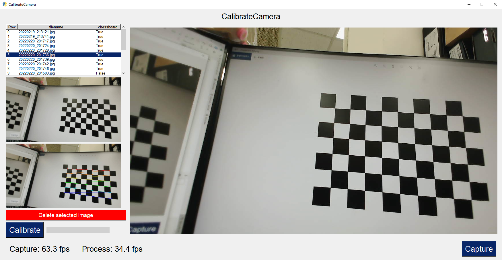
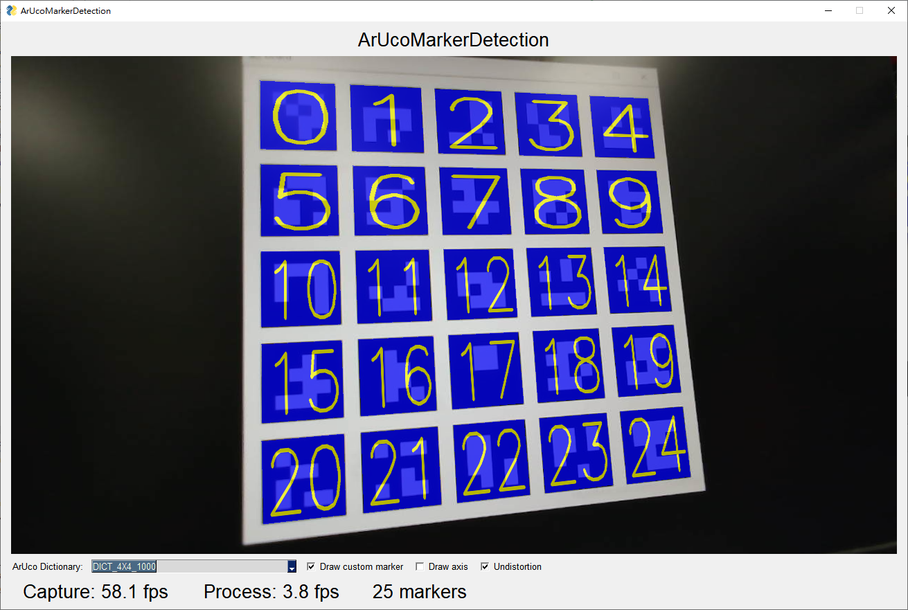

# ArUcoMarkerDemo

Realtime ArUco marker detection demo

## Usage

### Calibration

1. Print the [chessboard image](images/chessboard_9x6.png) and paste it on a flat (or show it on the screen directly).
2. Start the calibration application.
    ```bash
    python calibrate_camera.py
    ```
3. Capture some pictures using the camera that is going to be calibrated. (Use `Capture` button)  
   Each photo must include the chessboard image in it.
4. Click the `Calibrate` button.  
   Camera matrix and distortion coefficients will be saved to `camera.yml`.

### Detection

1. Start the application.
    ```bash
    python detect.py
    ```
2. Choose `ArUco Dictionary`
3. Aim the lens on the ArUco marker.

## Screenshot



